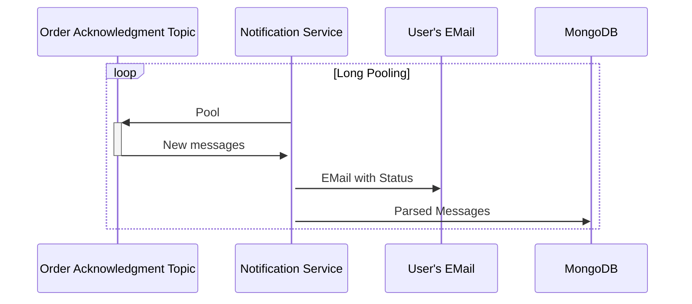

# Notification Service

Basic Notification service

Consists of Fetch REST API and acts as Consumer for Order Acknowledgment Events

**Consumer actions**



**API
Specification:** [Swagger Hub](https://app.swaggerhub.com/apis-docs/ReDestroyDeR/notification-service-fetch-api/1.0.0)

### Avro Schemas

**Key**

```avro schema
{
  "type": "record",
  "name": "KeyOrderAcknowledgment",
  "namespace": "streamprocessing.avro",
  "fields": [
    {
      "name": "user_address",
      "type": "string"
    }
  ]
}
```

**Value**

```avro schema
{
  "type": "record",
  "name": "ValueOrderAcknowledgment",
  "namespace": "streamprocessing.avro",
  "fields": [
    {
      "name": "event",
      "type": {
        "type": "enum",
        "name": "OrderAckStatus",
        "symbols": [
          "ACK",
          "NACK"
        ]
      }
    },
    {
      "name": "orderId",
      "type": "string",
      "default": "-"
    },
    {
      "name": "orderTotalPrice",
      "type": "int",
      "default": 0
    },
    {
      "name": "userBalance",
      "type": "int",
      "default": 0
    }
  ]
}
```