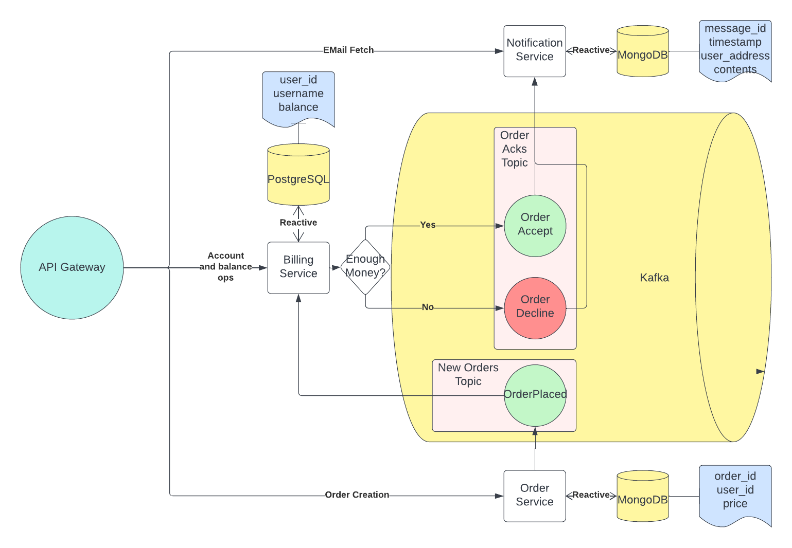

# StreamProcessing

Otus Microservice Architecture Homework

This microservice application allows for creating simple billing and orders to it, then retrieving notification of
accepted/declined order (in russian =() via API of the Notification Service

### OpenAPI definitions

Billing Service: [Swagger Hub](https://app.swaggerhub.com/apis-docs/ReDestroyDeR/billing-api/1.0.0)

Order Service: [Swagger Hub](https://app.swaggerhub.com/apis-docs/ReDestroyDeR/order-service_api/1.0.0)

Notification
Service: [Swagger Hub](https://app.swaggerhub.com/apis-docs/ReDestroyDeR/notification-service-fetch-api/1.0.0)

### Kubernetes Deployment

#### Prerequisites:

1. Kubernetes Cluster
2. Helm

#### Setup:

1. Install istiod

```bash
helm repo add istio https://istio-release.storage.googleapis.com/charts
helm repo update
kubectl create namespace istio-system
helm install istio-base istio/base -n istio-system
helm install istiod istio/istiod -n istio-system --wait
```

2. Install istio-ingress

```bash
kubectl create namespace istio-ingress
kubectl label namespace istio-ingress istio-injection=enabled
helm install istio-ingress istio/gateway -n istio-ingress --wait
```

3. Run `bootstrap.sh` in KubernetesDeployment folder. It will install everything needed into newly created
   namespace `stream-processing`

#### Uninstall:

1. Run `tear-down.sh` in KubernetesDeployment folder.
2. `kubectl delete ns stream-processing`

#### System requirements with default configuration:

*Slightly overshot and not under stress*

1. Kafka
   1. Zookeeper - 6 Gi of Storage and 250 Mi of RAM
   2. Kafka - 3 Gi of Storage and 1 Gi of RAM
   3. Control Center - 800 Mi of RAM
   4. Schema Registry - 400 Mi of RAM
2. MongoDB - 8 Gi of Storage and 200 Mi of RAM
3. PostgresSQL - 3 Gi of Storage and 90 Mi of RAM
4. Billing Service - 250 Mi of RAM
5. Notification Service - 250 Mi of RAM
6. Order Service - 250 Mi of RAM

**Total:** 20 Gi of Storage and ~4 Gi of RAM

### IntelliJ Idea

0. `git clone https://github.com/ReDestroyDeR/StreamProcessing`
1. Start all the dependencies via `docker-compose up -d`
2. Change server ports of `BillingService`, `NotificationService` and `OrderService`:

```bash
cd BillingService
printf "server:\n\tport: 7000" >> ./src/main/resources/application.yaml
cd ../NotificationService
printf "server:\n\tport: 7001" >> ./src/main/resources/application.yaml
cd ../OrderService
printf "server:\n\tport: 7002" >> ./src/main/resources/application.yaml
```

*P.S. It's important to revert these changes as soon as you plan to pack services into docker image!*

3. Open `StreamProcessing` in IntelliJ as Project
4. (Optional) If modules haven't been detected automatically you need to:
   1. **File** -> **Project Structure** -> **+** -> **Import module** -> **(
      NotificationService/OrderService/BillingService)** -> **Maven**
   2. Wait until they don't appear in Project Structure Menu
5. Generate Avro schemas for each service `mvn avro:schema`
6. Mark `target/generated-sources` as generated sources folder in **Project Structure**
   1. **... Service** -> **Sources** -> **Select target/generated-sources** -> **Alt + S** -> **(On the right panel)
      Source Folders target/generated-sources Edit properties (Pencil Symbol)** -> **Check For generated sources**
7. Install reactor-kafka *(I don't know why I added it, don't like their API tbh)*

```bash
cd OrderService
./install-reactor-kafka
```

8. You have ready development deployment!

### Postman tests

Every service contains `.postman_collection.json`

Import them to your workspace to get started

Tests use environment variables, it's better to create one for this Project

If you're running requests via *Runner* be careful!
**Billing Service** has FUNDS operation above billing creation, so these requests will have **NO EFFECT**
Be sure to move *POST* Create Billing above these two requests

### Architecture



